I work the seam where clinical operations become revenue, and I build analytics that prove their own numbers: every metric on this page regenerates from a repo you can clone and run.

  
  <!-- [VERIFY] replace YOUR-SLUG with the real LinkedIn slug before pushing -->
  
  

## The numbers

<table>
  <tr>
    <td align="center">&#8987; <b>3+ years</b> Epic HB / Resolute across large health systems</td>
    <td align="center">&#129514; <b>150+ scenarios</b> UAT executed for an Epic upgrade cycle</td>
    <td align="center">&#128202; <b>5K+ daily txns</b> supported, manual reporting effort cut 30%</td>
    <td align="center">&#127942; <b>4 certifications</b> Johns Hopkins &#215;2, MedCerts &#215;2</td>
    <td align="center">&#128230; <b>4 repos</b> every benchmark measured, 95&#8211;96% test coverage</td>
  </tr>
</table>

## Stack, by depth

## Featured work

Four repos, four different revenue cycle bottlenecks, four different mechanisms. Each includes a labeled synthetic data generator, so detection quality is a measurement against ground truth, not a claim.

| Repo | What it proves | Headline number |
|---|---|---|
| [**claims-denial-leakage-miner**](https://github.com/ManojKumarChunduru/claims-denial-leakage-miner) | Preventable denials can be classified to an actionable root cause even when remit codes lie | **99.5% precision, 100% recall, 99.1% cause accuracy**; $5.57M of $7.28M denied dollars traced to six preventable causes; 126K claims/s |
| [**rcm-upgrade-regression-sentinel**](https://github.com/ManojKumarChunduru/rcm-upgrade-regression-sentinel) | Upgrade UAT can be a declared contract with a measured catch rate, not an eyeball exercise | **100% catch rate over 1,299 planted regressions**, zero false alarms on a benign-only control; 1M rows in 67s; generates the Excel sign-off workbook |
| [**hl7-charge-capture-reconciler**](https://github.com/ManojKumarChunduru/hl7-charge-capture-reconciler) | Ordered care that never becomes a posted charge is findable and priceable from raw HL7v2 | **0.98 missing-charge recall** with honest false positive accounting; ~30K msg/s; $1.8M missing and $2.8M late charges priced |
| [**workqueue-flow-radar**](https://github.com/ManojKumarChunduru/workqueue-flow-radar) | Conflicting routing rules that ping-pong claims between queues can be caught and named from the event log alone | **1.0 precision and recall** on labeled victims; 1.1M events in 7s; renders the daily ops packet (Excel + PDF) |

Each repo carries architecture decision records, a documented war story with its fix commit, one feature deliberately out of scope with its trigger, and a README that says out loud when a perfect metric is a property of the synthetic world.

## Building blocks

  
  
  
  
  
  
  
  
  
  
  
  

## Current focus

- Turning denial reports into root-cause worklists a biller can act on without asking why a claim was flagged
- Automating UAT evidence for EHR upgrade cycles: the tolerance spec is the test plan, the workbook is the artifact
- Workqueue flow analytics: aging, first-pass yield, and the routing conflicts native queue views cannot see
- Porting the repos' plain-SQL models to MS SQL Server syntax, the warehouse most hospital reporting teams run

## Pivot point

I learned the revenue cycle from inside its workflows: UAT scripts, workqueues, and production support tickets at hospital scale. Then I went back to school for the data discipline (MS in Data Management &amp; Analytics, 2024) to measure what I had been supporting. The four repos above are that pivot made public: the same denials, charges, upgrades, and queues, now with labeled ground truth, benchmarks, and CI behind every claim.

<!-- Outside the code: add a short emoji hobby row here if Manoj wants one; nothing invented on his behalf -->

## Quick connect

  
  <!-- [VERIFY] LinkedIn slug -->
  
  

The fastest way to evaluate me: `git clone` any pinned repo and run the three-command quickstart.

<!-- profile views counter: low signal, some recruiters ignore it; delete this line to remove -->

